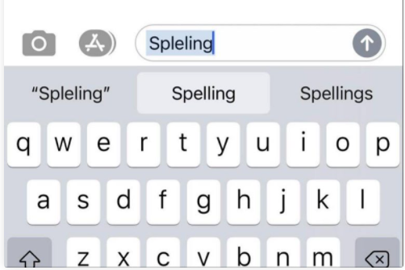

# Autocomplete e Autocorrect + Very Small Text Editor (vSTE)

### Sumário
1. [Introdução](#Introdução)
2. [O problema](#O-problema)
3. [Interface](#Interface)
4. [Implementação](#Implementação)
5. [Saída](#Saída)

# 1-Introdução

Autocomplete é uma ferramenta comum em aplicações modernas. Enquanto o usuário digita, o programa prevê o quê o usuário está tentando digitar (usualmente uma palavra ou frase).

Segue abaixo um exemplo típico do Autocomplete e do Autocorrect:




Tanto o Autocomplete quanto o Autocorrect são mais efetivos quando quando existe um número limitado de possibilidades mais prováveis. Por exemplo, a _Internet Movie Database_ usa essas duas soluções para mostrar os nomes dos possíveis filmes enquanto o usuário digita e para buscar por nomes mais prováveis caso haja um erro de digitação; _engines_ de busca usam essas técnicas para mostrar sugestões de busca e buscar resultados mais prováveis; celulares usam a técnica para acelerar a digitação de textos.

Nestes exemplos, as aplicações preveem qual a chance estar sendo digitada uma dada sentença e apresenta ao usuário uma lista das sentenças mais prováveis, na ordem decrescente de "peso". Os pesos de um conjunto de sentenças são determinados por vários fatores, tais como o volume de vendas de um determinado filme, a frequencia de busca de cada sentença no Google ou o histórico de palavras digitadas pelo usuário do celular. 

A performance desse tipo de sistema é uma característica critica. Por exemplo, considere uma _engine_ de busca que executa uma aplicação de autocomplete em um servidor. De acordo com alguns estudos, a aplicação tem apenas algo como 50ms para retornar uma lista de sugestões de forma que essa lista seja útil para o usuário, e a aplicação tem que executar esse processamento para cada tecla digitada **para cada usuário do sistema**. Já para o autocorrect essa restrição de tempo é um pouco menor uma vez que as sujestões de correção só aparecem após a busca ou quando o usuário terminou de digitar uma palavra.

# 2-Autocomplete vs Autocorrect

Neste trabalho iremos implementar um sistema simples de _autocomplete_ e _autocorrect_, ambos os problemas são abordados de formas diferentes, enquanto o autocomplete apenas usa
uma base de dados e o prefixo buscado, o autocorrect usa o [algoritmo da distancia de edição](https://pt.wikipedia.org/wiki/Dist%C3%A2ncia_Levenshtein).

## 2.1-Autocomplete

Usando a base de dados fornecida no inicio do programa, nosso sistema tem um conjunto de palavras no formato `peso + sentença`, onde a `senteça` é uma string que pode ser um possível resultado de uma operação de autocomplete, e o peso é um inteiro que representa a relevancia daquela sentença na base de dados: quanto maior o valor do peso, maior a relevancia da sentença relacionada com ele. Abaixo é mostrado um exemplo de uma base de dados de entrada, chamada [wikitionary.txt](./data/wikitionary.txt), que representa a frequencia que algumas palavras aparecem em textos em Inglês.

```
5627187200	the
3395006400	of
2994418400	and
2595609600	to
1742063600	in
1176479700	i
1107331800	that
1007824500	was
879975500	his
        ...
392323	calves
```

Note que a palavra **"the"** é a mais frequente neste caso, uma vez que ela tem o maior valor de peso: 5627187200. Claro que esse dicionário não é completo, uma vez que ele contém apenas 10 mil palavras. Após processada a base de dados o nosso sistema de autocomplete deve ser capaz de mostrar ao usuário todas as palavras que iniciam com tal prefixo, ou
alguma mensagem caso o prefixo não seja encontrado, por exemplo _"no match found"_.

## 2.2-Autocorrect

De forma similar ao autocomplete, o autocorrect usa a mesma base de dados, porém ao invés de buscar apenas por prefixos o programa deve buscar apenas por palavras de um determinado tamanho. Nesse caso usaremos ambas as informações de frequencia e de tamanho da plavra.

O algoritmo da distancia de edição é um algoritmo comum na computação que é usado para encontrar **qual é a menor quantidade de manipulações específicas que transforma uma string A na string B**. Existem diversas formas de computar essa distância bem como algumas operações que podem ser ignoradas ou consideradas para simplificar o problema. Neste caso iremos considerar apenas operações de remoção, adição ou mudança de caractere. Além disso, precisamos limitar a quantidade de palavras que entrarão no cômputo da distancia de edição caso contrário iremo perder desempenho um considerável no trabalho. Para tanto use como candidados as N palavras mais relevantes que tem tamanho S+1 e S-1 onde S é o tamanho da palavra base. Escolha um valor de N que deixe o programa **usável**.


# 3-Interface

No exemplo abaixo, o programa tem nome de `words_complete_correct`, ele deve ler os argumentos da linha de comando como segue:

```
% ./words_complete_correct
Usage: words_complete_correct <databse_file>
  Where <database_file> is the ascii file that contains the query terms and weights.
```

O `<database_file>` é um arquivo de texto que contém as entradas, cada uma contendo uma **sentença** e seu valor correspondente de **peso**. Dois arquivos de dadatabase podem ser encontrados no diretório [data](./data).

Depois de ler e processar a base de dados de entrada, o seu sistema deve perguntar ao usuário por um fragmento de palavra ou senteça (ou mesmo uma palavra/sentença inteira). Depois disso, o programa deve _encontrar e retornar todas as possiveis sentenças na base de dados que iniciam com o fragmento/palavra/sentença_ que foi fornecido, e que são candidatas do algorítmo de correção automática. O programa deve mostrar mostrando o resultado na ordem decrescente de peso, separando uma coluna para o autocomplete e outra para o autocorrect. No caso em que o termo não foi encontrado, o programa deve imprimir a mensagem _"no match found"_.

Após isso o programa deve perguntar novamente por um novo prefixo de palavra ou sentença até que o usuário envie EOF(<kbd>Ctrl</kbd> + <kbd>z</kbd>) para terminar.

# 4-Implementação

Fique à vontade para modelar o programa como você achar que deve. No entanto, faça ao menos 4 classes:

1. Uma classe deve ficar à cargo da Interface com o usuário, especialmente ler a entrada e escrever as possíveis saídas.
2. Uma classe deve ficar à cargo de processar e guardar as informações do banco de dados.
3. Uma classe de ficar à cargo de computar o conjunto do autocorrect.
4. Outra classe deve ficar à cargo de computar o conjutno do autocomplete.

Como, neste caso, estamos interessados também na eficiencia da solução, os passos recomendados para resolver o problema são:

1. Leia o arquivo da base de dados e ordene pela _string_ correspondente à sentença;
2. Leia a entrada do usuário. Caso o usuário entre EOF (`<Ctrl>+D`) finalize, caso contrário, vá para o passo seguinte;
3. Execute uma `busca binária` para encontrar criar um conjunto com todas as entradas da base que iniciam com o prefixo buscado, para tanto você pode usar os algoritmos da stl: [`lower_bound`](http://en.cppreference.com/w/cpp/algorithm/lower_bound) e [`upper_bound`](http://en.cppreference.com/w/cpp/algorithm/upper_bound);
4. Ordene o conjunto criado pelo peso
5. Apresente o resultado para o usuário e volte ao passo 2.

Outro ponto à observar é o uso de referencias ao invés de cópias quando tratamos tipos não básicos. C++ é uma linguagem muito eficiente, mas que pode perder desempenho a medida que começamos a usar cópias ao invés de referencias, especialmente quando os dados processados são escalares (vetores, matrizes, etc). Neste trabalho, quando for processar objetos que são compostos por arrays, seja em parâmetros dos métodos/funções ou nos retornos destes, tente usar referencias ao invés de cópias.

# Saída

Seguem algumas saídas, cada uma com base em uma base de dados diferente. O primeiro exemplo executa usando a base  `cities.txt`. O usuário entra com __"São P"__.


Neste segundo exemplo, a base de dados é `wiktionary.txt` e a string buscada foi __"pret"__.


Note que o programa não deve ser **case sensitive**. Ou seja, não deve fazer diferença se o usuário digita "São P", "são p", "SÃO P",  ou qualquer variação de maiúscula ou minúscula. A entrada do usuário deve ser convertida para um case qualquer (todas maiúsculas ou todas minúsculas), para facilitar a operação de busca na base de dados.

# Autorship

The description of this programming assignment was taken from [Computer Sciecne at Pricenton University](http://introcs.cs.princeton.edu/java/assignments/autocomplete.html).

**Adaptation: Selan R. Santos, [selan@dimap.ufrn.br](mailto:selan@dimap.ufrn.br)**

**Translation to PT-Br and Adaptation: Julio Melo, [julio.melo@imd.ufrn.br](mailto:julio.melo@imd.ufrn.br)**

&copy; DIMAp/UFRN 2021.
&copy; IMD/UFRN 2021.
